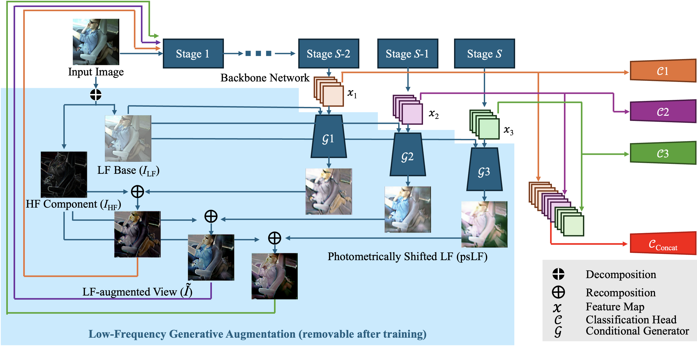

# Low-Frequency Generative Augmentation for Driver Distraction Recognition

This repository contains the official PyTorch implementation for the paper:

**Train Once, Apply Broadly: Low-Frequency Generative Augmentation for Driver Distraction Recognition under Photometric Shifts**



---

### Environment

This source code was tested in the following environment:

    Python = 3.10
    PyTorch = 1.11.0
    torchvision = 0.12.0
    Ubuntu 20.04.6 LTS
  
  ### Dataset

We use public driver distraction recognition datasets `AUC Distracted Driver (AUC-DDD)` and `State Farm Distracted Driver (SFD)` as the single labeled source.

For zero-shot video evaluation we use `Driver Monitoring Dataset (DMD)`.

-   For `AUC-DDD` and `SFD`, please organize the images as:
  ```
datasets/organized/
├── AUCD
│   ├── train
│   │   ├── safe_driving
│   │   ├── texting_right
│   │   ├── …
│   ├── validation
│   │   ├── safe_driving
│   │   ├── texting_right
│   │   ├── …
│   ├── AtoS
│   │   ├── safe_driving
│   │   ├── texting_right
│   │   ├── …
│   ├── AtoB
│   │   ├── safe_driving
│   │   ├── texting_right
│   │   ├── …
│   └── AtoL
│       ├── safe_driving
│       ├── texting_right
│       ├── …
└── SFD
    ├── train
    │   ├── safe_driving
    │   ├── texting_right
    │   ├── …
    ├── validation
    │   ├── safe_driving
    │   ├── texting_right
    │   ├── …
    ├── StoA
    │   ├── safe_driving
    │   ├── texting_right
    │   ├── …
    ├── StoB
    │   ├── safe_driving
    │   ├── texting_right
    │   ├── …
    └── StoL
        ├── safe_driving
        ├── texting_right
        ├── …
```

AtoS / AtoB / AtoL (and StoA / StoB / StoL) denote synthetic cross-appearance test sets: we perform photometric remapping via neural style transfer on images from the source dataset (A = AUC-DDD, S = SFD) to simulate appearance changes under different camera/ISP pipelines and lighting conditions. Specifically, AtoS remaps AUCD images to the SFD camera/ISP style, AtoB remaps them to the iPhone 13 (bright sunlight) style, and AtoL remaps them to the Anero Car DVR (low light) style; StoA / StoB / StoL are defined analogously (with SFD as the source). These sets are used for single-source domain generalization evaluation (no target-domain labels or adaptation), for testing only, with labels identical to the originals; each directory is organized directly by the 10 class names.


-   For `DMD`, download the dataset and extract the `.tar.gz` archives into a folder named `dmd`. Then decode each video into frames and organize them as:
```
dmd_frames/
├── gA/
│   ├── 1/
│   │   ├── s1/
│   │   │   └── gA_1_s1_2019-03-08T09;31;15+01;00_rgb_mosaic_body_frames_256/
│   │   │       ├── frame_000000.jpg
│   │   │       ├── frame_000001.jpg
│   │   │       ├── frame_000002.jpg
│   │   │       ├── frame_000003.jpg
│   │   │       ├── frame_000004.jpg
│   │   │       ├── frame_000005.jpg
│   │   │       ├── frame_000006.jpg
│   │   │       ├── frame_000007.jpg
│   │   │       ├── frame_000008.jpg
│   │   │       ├── frame_000009.jpg
│   │   │       └── … 
│   │   ├── s2/
│   │   │   └── gA_1_s2_…_rgb_mosaic_body_frames_256/
│   │   │       ├── frame_000000.jpg
│   │   │       ├── frame_000001.jpg
│   │   │       └── …
│   │   └── …
│   ├── 2/
│   │   ├── s1/
│   │   │   └── gA_2_s1_…_rgb_mosaic_body_frames_256/
│   │   │       ├── frame_000000.jpg
│   │   │       └── …
│   │   └── …
│   └── …
├── gB/
│   ├── 1/
│   │   ├── s1/
│   │   │   └── gB_1_s1_…_rgb_mosaic_body_frames_256/
│   │   │       ├── frame_000000.jpg
│   │   │       └── …
│   │   └── …
│   └── …
├── gC/
│   └── …
├── gE/
│   └── …
├── gF/
│   └── …
└── gZ/
    └── …
```
    


### Train

    python train.py --set AUCD
    python train.py --set SFD
   
The weights and training/testing results will be automatically saved in the `results` folder.


### Zero-shot Cross-Device Evaluation

Edit `ROOT_JSON_DIR`, `ROOT_FRAMES_DIR`, and `CKPT_PROPOSED` in `eval_dmd.py`, then run:

    python eval_dmd.py
